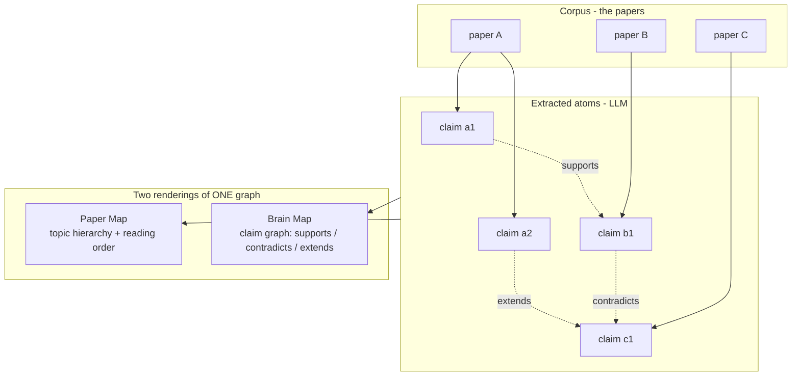
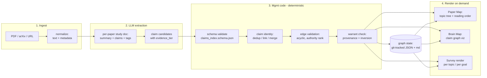
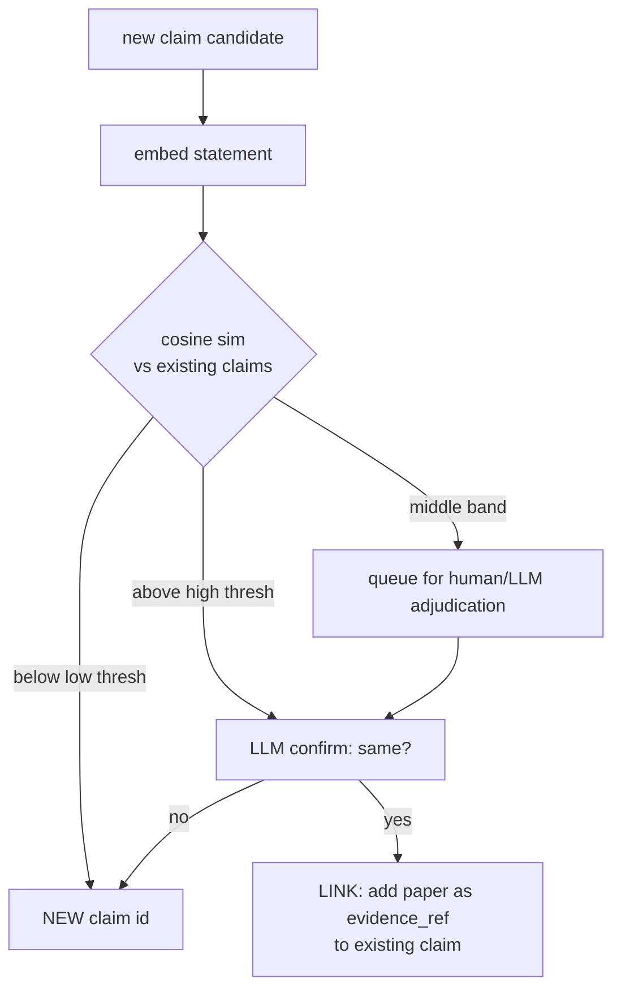

# Brainstorm — Paper Map + Brain Map (LLM-driven, code-hardened)

*Status: speculative brainstorm. Not a plan, not a decision. The purpose is to frame the
problem, propose an architecture that reuses the `cross-team/` substrate rather than
reinventing it, and mark the genuinely hard part so the eventual plan spends effort where it
matters. Timestamp from `date`: 2026-07-15 21:46 PDT.*

---

## 0. TL;DR (my take)

**Build it as an LLM extraction pipeline hardened by deterministic management code — but do
not build a new system.** You already assembled ~70% of the machinery in `cross-team/`:

- The **`study`** artifact type (`artifact_types.json` v1.3) is *literally* "systematic
  synthesis of external references for internal use" — i.e. a read paper's internal record.
- The **`claims_index`** schema (parallax) is almost exactly the **brain-map atom**: a claim
  with `evidence_tier`, `status`, `superseded_by`, `convergence_tag`. Papers make claims;
  the brain map is the claim graph.
- **`warrant`** is the **hardening layer** you're reaching for: provenance validation,
  authority-inversion detection, retired-knowledge exclusion, acyclic supersede/refute graph.

So the two deliverables map cleanly:

| Your ask | What it is | Existing substrate |
|---|---|---|
| **Paper map** (navigable) | corpus organized into a topic hierarchy + reading order | `study` docs + a generated topic index (survey-like) |
| **Brain map** | the *idea* graph: claims, evidence, agreements/contradictions across papers | `claims_index` schema + `warrant` provenance edges |

The **survey paper is the wrong primitive to imitate.** A survey is a *frozen linearization*
of a graph at one point in time — it goes stale, it's one author's cut, and it hides the
edges. What you want is the **living graph**, from which a survey (or many surveys, per topic
/ per reading-goal) can be *rendered on demand*. LLM builds the graph; code keeps it honest;
rendering is cheap and disposable.

**Where to spend design effort:** claim identity / dedup / merge (the "is this the same idea
as that one?" problem). Everything else is plumbing you mostly have.

---

## 1. Reframing the problem

### 1.1 Two maps, one graph



- **Paper map** = the *node* view grouped by topic. "What have I read on X, in what order
  should a newcomer read it, what's must-read vs optional." This is the **navigable survey**.
- **Brain map** = the *edge* view. "Which claims support/contradict/extend which. Where's the
  consensus, where's the open dispute, what got superseded." This is the **understanding**.

They are two projections of the same underlying `(papers, claims, edges)` graph. Build the
graph once; render both.

### 1.2 Why not "just write a survey with an LLM"

A one-shot LLM survey is seductive and wrong for a *living* library:

1. **It's a linearization.** The moment you flatten the graph to prose, you lose queryability
   ("show me everything that contradicts claim X") and you can't diff it as you read more.
2. **It goes stale silently.** Add 5 papers → the survey is now wrong, but nothing tells you.
3. **No provenance guarantees.** An LLM survey will confidently assert edges ("A refutes B")
   that no code ever checked. That's exactly the failure `warrant` was built to catch.
4. **One cut.** A survey answers one reading goal. The graph answers many.

The survey becomes a **render target**, not the source of truth. (This mirrors the parallax
`claims_index` design note: the index is *compiled*, "not hand-maintained, so it can't go
stale.")

---

## 2. Architecture: LLM flow hardened by mgmt code

The governing principle (straight from parallax's exchange model): **the LLM proposes; the
code disposes.** LLM does open-world extraction and semantic judgment; deterministic code owns
schema, identity, graph invariants, and idempotency. Every LLM output passes through a
validation gate before it becomes state.



### 2.1 The division of labor (what LLM does vs what code does)

| Concern | Owner | Why |
|---|---|---|
| Read PDF, summarize, extract claims, tag topics, propose edges | **LLM** | open-world semantic work, no deterministic algorithm exists |
| Assign `evidence_tier` (measured/inferred/conjectural) | **LLM proposes, code enforces enum** | judgment + a closed vocabulary |
| Schema conformance (fields, enums, id format) | **code** | `claims_index.schema.json` already exists |
| Claim identity (is this claim == that claim?) | **code + LLM (hybrid)** | THE hard part — see §4 |
| Graph invariants (acyclic supersede, authority rank) | **code** | `warrant` already does the acyclic + rank checks |
| Provenance / authority inversion | **code** | `warrant/_check_frontmatter.py` verbatim |
| Idempotency (re-run doesn't duplicate) | **code** | stable ids + content hashing |
| Rendering (survey, viz, reading order) | **code (LLM optional for prose)** | pure function of the graph |

The load-bearing idea: **an LLM hallucinating an edge is a bug the code catches**, exactly
like parallax catches a contamination. You never trust LLM output as state; you trust it as a
*proposal* that must survive the gate.

---

## 3. The data model (reuse, don't reinvent)

### 3.1 Per-paper: a `study` doc

One markdown doc per paper, `warrant`-valid frontmatter. This IS the paper-map node.

```yaml
---
artifact_type: study
authority: derived            # study -> derived per registry v1.3
generated_by: llm-extract-v1
parent_artifacts:             # the external paper, repo-qualified external ref
  - papers:arxiv/2401.12345
paper_id: arxiv:2401.12345
title: "..."
authors: [...]
year: 2024
topics: [moe/routing, systems/serving]   # hierarchical topic tags
reading_tier: 1               # 1 must-read .. 4 skip (mirrors parallax T1-T4)
status: read                  # toread | reading | read
claims: [C-MOE-ROUTING-1, C-MOE-ROUTING-2]   # ids into the brain map
---
# {title}

## TL;DR (LLM)
## Key claims (each -> claims_index entry)
## Method / evidence
## Relations (proposed edges: supports/contradicts/extends <claim-id>)
## My notes
```

The `reading_tier` reuses parallax's exact T1-T4 must-read..skip scale — so "organize by
importance" is already a solved vocabulary. The `toread | reading | read` status turns the
same doc into the **reading queue** (your "about to read" pile) with zero extra structure.

### 3.2 Cross-paper: the claim index (brain-map atoms)

Reuse `claims_index.schema.json` essentially as-is. Each claim:

- `id`: namespaced stable id (schema pattern `^[a-z0-9]+:[A-Z]+-[A-Z0-9_]+-[0-9]+$`), e.g.
  `moe:C-ROUTING-1`.
- `statement`: the claim in one sentence.
- `evidence_tier`: measured | inferred | conjectural (already the shared `evidence_axis`).
- `evidence_ref`: pointer to the paper + section/figure.
- `status`: open | corroborated | retired | superseded.
- `superseded_by`: newer claim id.

**New piece needed** (the only real schema extension): an **edges** structure for the brain
map. The current schema has `superseded_by` (a supersede edge) but not general
supports/contradicts/extends edges. Proposal:

```json
{
  "edges": [
    {"from": "moe:C-ROUTING-1", "to": "moe:C-ROUTING-2",
     "rel": "contradicts", "evidence_tier": "inferred",
     "asserted_by": "llm-extract-v1", "confirmed": false}
  ]
}
```

`rel` vocabulary (closed set, mgmt-code-enforced): `supports | contradicts | extends |
refines | uses_method_of | supersedes`. `confirmed: false` marks LLM-proposed-but-unreviewed
edges — the human (or a second LLM pass) flips them, mirroring parallax's
`convergence_tag` "not trusted until measured" discipline.

### 3.3 What each existing invariant buys you for free

- **Acyclic supersede graph** (`warrant` `_has_cycle`): your brain map can't say "A supersedes
  B supersedes A." Free.
- **Authority rank on retire edges** (H2): a weak/speculative claim can't silently retire a
  measured one without a `provenance_note`. Free contradiction-hygiene.
- **Retired-knowledge exclusion** (Rule 2): a survey render can automatically gray-out /
  exclude claims built on superseded parents. Free staleness handling.
- **Registry drift check**: every topic/type stays in the shared vocabulary. Free.

---

## 4. The hard part: claim identity (spend your design effort here)

Everything above is plumbing you mostly have. The problem that decides whether the brain map
is *useful* or *noise* is: **when are two extracted claims the same claim?**

Failure modes:
- **Over-merge:** two subtly different claims collapse to one → you lose the disagreement,
  which is the whole point of a brain map.
- **Under-merge:** the same idea from 5 papers becomes 5 nodes → no consensus emerges, the
  graph is a hairball.

### 4.1 Proposed hybrid identity pipeline



- Deterministic **embedding + threshold** does the cheap triage (code).
- **LLM adjudicates** the ambiguous middle band with the two statements + their contexts
  (semantic judgment).
- **Human** owns the truly ambiguous / high-stakes merges (small volume).
- Every merge/link decision is **logged** (a manifest, exactly like parallax's read log) so
  identity decisions are auditable and reversible.

### 4.2 Why this is the right place for the LLM/code split

Identity is *irreducibly* semantic (LLM) but *catastrophic if wrong and unlogged* (code). So:
LLM proposes the merge, code records it immutably and enforces that a merge is reversible
(keep both original extractions; the merge is a link, not a destructive rewrite). This is the
"leak doctrine" applied to knowledge: a wrong merge isn't fatal *if it's declared and
reversible*.

---

## 5. The pipeline as code (management layer)

Concrete shape, mirroring parallax's "single script, subcommands" ergonomics:

```
papermap ingest <pdf|url>        # -> normalized text + metadata (code)
papermap extract <paper_id>      # -> study doc + claim candidates (LLM, gated)
papermap link <paper_id>         # -> run identity pipeline, propose edges (hybrid)
papermap check                   # -> warrant + schema + graph invariants (code, CI gate)
papermap render paper-map        # -> topic tree + reading order (code)
papermap render brain-map        # -> claim graph viz, e.g. mermaid/graphviz (code)
papermap render survey <topic>   # -> on-demand survey prose (LLM from graph, optional)
papermap queue                   # -> the toread/reading/read reading list (code)
```

- `check` is the **hardening gate** — nothing enters `main` state without passing it. This is
  your "hardened with mgmt code" requirement made concrete: the LLM's creative output is
  quarantined until deterministic checks pass. Wire it as a pre-commit / CI hook, same posture
  as warrant.
- Everything is **git-native** (your stated preference): study docs are markdown, the index is
  JSON, edges are JSON, all diffable, all versioned. No database, no GUI. The reading queue is
  a `render` of frontmatter, not a separate store.

---

## 6. Open questions / decisions to make before a real plan

1. **New repo or a `study/` module in an existing consumer repo?** The `cross-team/` repos are
   *governance interfaces* (shared, bilaterally amended). A personal paper library is a
   *consumer* — it should live in its own repo that **consumes** `artifact_types` (vocabulary)
   + optionally `warrant` (validation), not modify them. Recommendation: new repo
   `paper-library/` that submodules `artifact_types` + `warrant`, reusing this exact pattern.
2. **Does the brain-map `edges` structure belong in `claims_index` (amend the shared schema)
   or in a library-local schema?** Amending the shared schema triggers the bilateral
   amendment process (proposal -> review -> version bump). Cleaner first move: a **local**
   `edges.schema.json` in the library repo; promote to the shared schema only if a second
   consumer needs it (matches the AGENTS.md "don't promote to meta until independently
   corroborated" discipline).
3. **Topic taxonomy: fixed vs emergent?** Fixed = predictable navigation, manual upkeep.
   Emergent (LLM-clustered) = self-organizing but unstable ids. Likely hybrid: LLM proposes
   topics, they get registered into a stable local taxonomy (a `topics.json`), so the tree is
   navigable AND grows.
4. **Embedding model + thresholds** for identity — needs a small calibration set of known
   same/different claim pairs before trusting the auto-merge band.
5. **How much autonomy?** Parallax's ladder (rung 0 manual -> rung N autonomous, each rung
   gated on enforcements being live) is the right model: start with LLM-proposes /
   human-confirms every edge; raise autonomy only after the `check` gate has proven it catches
   bad edges.

---

## 7. Recommendation (one paragraph)

Build a new **`paper-library/`** consumer repo that reuses the `cross-team/` substrate: one
`study` doc per paper (the paper-map node + reading-queue entry via `status`/`reading_tier`),
a `claims_index`-shaped brain map extended with a local `edges` schema, an LLM extraction
pipeline whose every output passes a deterministic `check` gate (schema + `warrant` provenance
+ acyclic/rank graph invariants) before becoming git-tracked state, and **on-demand renderers**
for the navigable paper map, the brain-map graph viz, and *disposable* per-topic surveys.
Treat the survey as output, never as source of truth. Put your real design effort into **claim
identity/merge** (§4) — that's the only genuinely hard, quality-determining component;
everything else you have already built.
