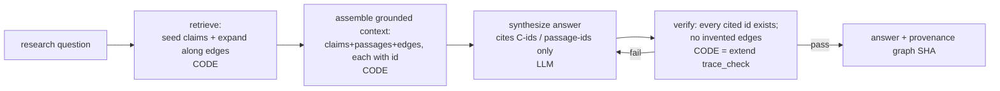

# Brainstorm — Querying the Brain-Map: LLM Research-QA over the Graph (the read side)

*Status: speculative brainstorm — the design for the READ layer (S7), the counterpart to the
S0–S6 write pipeline. Not yet built. Persisted per request. Timestamp from `date`:
2026-07-16 01:28 PDT.*

---

## 0. TL;DR

The S0–S6 spike built the **write side** (papers → condensed typed claim graph). This is the
**read side**: use the brain-map to answer research questions. The key reframe:

> Answering a question is **not** re-reading PDFs. It is: **retrieve a relevant subgraph →
> ground the LLM in it → let it synthesize → verify its citations.**

This is the same "LLM proposes, code disposes" split, applied to reading:
- **On write**, code validated the schema.
- **On read**, code does **retrieval + citation verification**; the LLM only synthesizes inside
  a fenced, provenance-tagged context.

That verification gate is the whole reason the answer is trustworthy for research rather than
confident-but-unchecked — the same guarantee `warrant` gives docs and `trace_check.py` gives
projections, now applied to generated answers.

## 1. The read loop (mirror of the build loop)



## 2. Why retrieval is a GRAPH query, not just similarity (the payoff)

This is why building the graph was worth it. Chunk-RAG can only surface "text that sounds
similar." The typed, provenance-tagged graph answers question *types* that vanilla RAG
structurally cannot:

| Research question | Graph operation | Current graph answers it |
|---|---|---|
| "What bottleneck recurs across these papers?" | claim with many `supports` in-edges | **C-SYNTH-2** (bandwidth/data-movement) ← C-MOEDM-1, C-H2LLM-1 |
| "What design method do they share?" | support/shared-assumption cluster | **C-SYNTH-1** (DSE) ← C-CONCORDE-3, C-H2LLM-2 |
| "Where do papers rest on the same assumption?" | `shares_assumption_with` edges | E-1 (H2-LLM↔Concorde), E-4 (MoE↔H2-LLM) |
| "What contradicts X / where is the open dispute?" | follow `contradicts` edges | none yet — one-hop when they exist |
| "What should I read on Z, in what order?" | paper-map filtered by topic, by `reading_tier` | already in `render.py paper-map` |
| "What's the frontier / least settled?" | `conjectural` claims + `proposed` edges | C-SYNTH-1..3; edges E-7/E-8 |

Retriever shape: **seed** (topic tag + embedding match on claim statements) → **expand k-hops
along edges** → **rank** by confidence × evidence_tier. The edge-expansion hop is exactly what
chunk-RAG lacks.

## 3. The grounded-context package (why it is token-cheap)

Assemble only: seed claims + their source passages + neighboring claims + the connecting edges,
each stamped with its `C-id`/`p-id`. A few KB carrying full provenance, versus dumping whole
papers. The condensation work (S2–S4) is what the query layer spends. Only `confirmed` edges
enter the truth context by default; `proposed`/`conjectural` included only when the question is
explicitly about the frontier.

## 4. The verification gate (the load-bearing part)

The LLM answer MUST cite `C-xxx` / passage ids. Then code re-checks every citation against the
graph — a direct extension of `trace_check.py`:
- Every cited claim id exists in `graph.json`.
- Every cited passage exists in the paper records.
- The answer asserts no relation ("A contradicts B") that isn't a confirmed edge.
- Fail → reject and re-ask (or flag), never emit unverified.

An answer citing something outside the library is a **caught bug**, not a silent
hallucination — the same discipline as the build side.

## 5. Concrete surface: `ask.py` (S7), mirroring `render.py`

```
python3 ask.py "what bottleneck recurs across these papers?"
  → retrieve {C-SYNTH-2, C-MOEDM-1, C-H2LLM-1, edges E-5/E-6}
  → grounded context (claims + the 3 source passages)
  → LLM answer citing [C-SYNTH-2 ← C-MOEDM-1, C-H2LLM-1]
  → verify: all cited ids exist ✓ → print answer + graph.json SHA provenance
```

- Pure-stdlib retriever at spike scale (12 claims → in-memory scan). Add the embedding index
  from the parent brainstorm §4 only when corpus scale demands it (the D4 measured-constraint
  posture from the S6 findings: index before DB).
- Every answer stamped with the `graph.json@sha256` it was produced from — so an answer is
  reproducible and its staleness is detectable, same as the S5 projections.

## 6. The honest limitation

Answer quality is **bounded by graph coverage**. Currently: abstract-only passages, 12 claims.
The system answers questions *about what has been condensed*; a question outside the graph must
return **"not in the library"** rather than improvise — the verify gate enforces that boundary.
Widening coverage = full-text passage ingestion (deferred in S2) + more papers.

## 7. Cross-team alignment

This read layer IS the "question workspace" gpt's plan converged on ("center the application
around research questions… question-specific syntheses" as a projection). So it is the natural
product surface, not a detour — and it stays local machinery (C8): `ask.py` is a consumer of
the local graph, not a shared-schema change.

## 8. Next (if built)

- **S7** — `ask.py`: retriever + grounded-context assembler + citation-verify gate (reuse the
  `trace_check.py` discipline). New tooling; the S0 study covers GraphRAG-adjacent prior art, so
  a one-line study-gate note suffices.
- DoD: for a fixed question, the answer cites only in-graph ids, passes the verify gate, and
  carries the graph SHA; an out-of-graph question returns "not in the library."
- Relay to gpt as measurement (the answer + its verified provenance), not prose.
