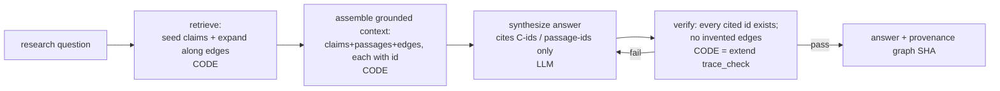

# Brainstorm — Querying the Brain-Map: LLM Research-QA over the Graph (the read side)

*Status: speculative brainstorm — the design for the READ layer (S7), the counterpart to the
S0–S6 write pipeline. Not yet built. Persisted per request. Timestamp from `date`:
2026-07-16 01:28 PDT.*

---

## 0. TL;DR

The S0–S6 spike built the **write side** (papers → condensed typed claim graph). This is the
**read side**: use the brain-map to answer research questions. The key reframe:

> Answering a question is **not** re-reading PDFs. It is: **retrieve a relevant subgraph →
> ground the LLM in it → let it synthesize → verify its citations.**

This is the same "LLM proposes, code disposes" split, applied to reading:
- **On write**, code validated the schema.
- **On read**, code does **retrieval + citation verification**; the LLM only synthesizes inside
  a fenced, provenance-tagged context.

That verification gate is the whole reason the answer is trustworthy for research rather than
confident-but-unchecked — the same guarantee `warrant` gives docs and `trace_check.py` gives
projections, now applied to generated answers.

## 1. The read loop (mirror of the build loop)



## 2. Why retrieval is a GRAPH query, not just similarity (the payoff)

This is why building the graph was worth it. Chunk-RAG can only surface "text that sounds
similar." The typed, provenance-tagged graph answers question *types* that vanilla RAG
structurally cannot:

| Research question | Graph operation | Current graph answers it |
|---|---|---|
| "What bottleneck recurs across these papers?" | claim with many `supports` in-edges | **C-SYNTH-2** (bandwidth/data-movement) ← C-MOEDM-1, C-H2LLM-1 |
| "What design method do they share?" | support/shared-assumption cluster | **C-SYNTH-1** (DSE) ← C-CONCORDE-3, C-H2LLM-2 |
| "Where do papers rest on the same assumption?" | `shares_assumption_with` edges | E-1 (H2-LLM↔Concorde), E-4 (MoE↔H2-LLM) |
| "What contradicts X / where is the open dispute?" | follow `contradicts` edges | none yet — one-hop when they exist |
| "What should I read on Z, in what order?" | paper-map filtered by topic, by `reading_tier` | already in `render.py paper-map` |
| "What's the frontier / least settled?" | `conjectural` claims + `proposed` edges | C-SYNTH-1..3; edges E-7/E-8 |

Retriever shape: **seed** (topic tag + embedding match on claim statements) → **expand k-hops
along edges** → **rank** by confidence × evidence_tier. The edge-expansion hop is exactly what
chunk-RAG lacks.

## 3. The grounded-context package (why it is token-cheap)

Assemble only: seed claims + their source passages + neighboring claims + the connecting edges,
each stamped with its `C-id`/`p-id`. A few KB carrying full provenance, versus dumping whole
papers. The condensation work (S2–S4) is what the query layer spends. Only `confirmed` edges
enter the truth context by default; `proposed`/`conjectural` included only when the question is
explicitly about the frontier.

## 4. The verification gate (the load-bearing part)

The LLM answer MUST cite `C-xxx` / passage ids. Then code re-checks every citation against the
graph — a direct extension of `trace_check.py`:
- Every cited claim id exists in `graph.json`.
- Every cited passage exists in the paper records.
- The answer asserts no relation ("A contradicts B") that isn't a confirmed edge.
- Fail → reject and re-ask (or flag), never emit unverified.

An answer citing something outside the library is a **caught bug**, not a silent
hallucination — the same discipline as the build side.

## 5. Concrete surface: `ask.py` (S7), mirroring `render.py`

```
python3 ask.py "what bottleneck recurs across these papers?"
  → retrieve {C-SYNTH-2, C-MOEDM-1, C-H2LLM-1, edges E-5/E-6}
  → grounded context (claims + the 3 source passages)
  → LLM answer citing [C-SYNTH-2 ← C-MOEDM-1, C-H2LLM-1]
  → verify: all cited ids exist ✓ → print answer + graph.json SHA provenance
```

- Pure-stdlib retriever at spike scale (12 claims → in-memory scan). Add the embedding index
  from the parent brainstorm §4 only when corpus scale demands it (the D4 measured-constraint
  posture from the S6 findings: index before DB).
- Every answer stamped with the `graph.json@sha256` it was produced from — so an answer is
  reproducible and its staleness is detectable, same as the S5 projections.

## 6. The honest limitation

Answer quality is **bounded by graph coverage**. Currently: abstract-only passages, 12 claims.
The system answers questions *about what has been condensed*; a question outside the graph must
return **"not in the library"** rather than improvise — the verify gate enforces that boundary.
Widening coverage = full-text passage ingestion (deferred in S2) + more papers.

## 7. Cross-team alignment

This read layer IS the "question workspace" gpt's plan converged on ("center the application
around research questions… question-specific syntheses" as a projection). So it is the natural
product surface, not a detour — and it stays local machinery (C8): `ask.py` is a consumer of
the local graph, not a shared-schema change.

## 8. Next (if built)

- **S7** — `ask.py`: retriever + grounded-context assembler + citation-verify gate (reuse the
  `trace_check.py` discipline). New tooling; the S0 study now carries a GraphRAG addendum row
  (see §10), so the study-gate is formally closed for the read side.
- DoD: for a fixed question, the answer cites only in-graph ids, passes the verify gate, and
  carries the graph SHA; an out-of-graph question returns "not in the library."
- Relay to gpt as measurement (the answer + its verified provenance), not prose.

## 9. Super-nodes / community summaries (the global-sensemaking layer)

The read loop above is **local**: seed → k-hop expand → answer. It is strong for "what
connects these claims" but weak for "what is the *overall shape* of everything I've read." That
global question is what a **super-node** answers: a synthesis node that summarizes a *region* of
the graph, so a global query hits one condensed node instead of scanning the whole graph.

**Two things called "survey" — keep them apart:**

| | External survey paper | Super-node (internal synthesis) |
|---|---|---|
| What it is | a paper someone else wrote | a **community summary** we compute over our own graph |
| How it enters | normal S2 ingest → a `paper` + its claims | a **materialized view** over a claim region |
| Truth status | evidence, cited like any paper | a *projection*, never a source of truth |
| Failure it invites | none new | going **stale silently** — the whole trap of §1.2 in the parent brainstorm |

So a super-node is **not an authored survey** (the stale trap the parent brainstorm rejected).
It is a **materialized view with cache invalidation** — a GraphRAG "community summary" hardened
with the same provenance discipline as `trace_check.py`.

### 9.1 Hierarchy (what regions get summarized)

`claim → topic-cluster → domain → library`. A super-node exists per *cluster* (and optionally
per domain, and one for the whole library). Each is the condensed answer to "what does this
region say, overall."

### 9.2 The non-stale mechanism (the load-bearing part)

The reason an authored survey rots is that nothing *computes* whether it is still true. A
super-node fixes this by making **staleness a computable predicate**, using region-scoped
provenance instead of a global SHA:

```json
{
  "supernode_id": "SN-DSE",
  "summary": "Design-space exploration is the shared design vehicle across ...",
  "coverage": ["C-SYNTH-1", "C-CONCORDE-3", "C-H2LLM-2", "E-2", "E-3"],
  "region_hash": "sha256(sorted(coverage) + their statements/rels)",
  "owner": "machine"
}
```

- `coverage` = the exact claim/edge ids this summary was computed from.
- `region_hash` = a hash over *just that region's* content.
- **Stale iff** `region_hash(now) != region_hash(stored)`. Adding a paper in an unrelated
  cluster does **not** invalidate `SN-DSE` — only a change inside its `coverage` does. This is
  the whole point of a *region* hash rather than the whole-graph `graph.json@sha256`: **precise
  invalidation**, so we regenerate one summary, not all of them.

### 9.3 Lifecycle (who marks, who regenerates)

- `build_graph.py` (S4), after compiling the graph, recomputes each super-node's `region_hash`
  and **marks stale** any whose region changed. It does not rewrite the summary — marking is
  deterministic, summarizing is LLM work (the same propose/dispose split).
- `regen_supernodes.py` (new, S8) regenerates **only** the stale ones via the LLM, then clears
  the flag. Cheap, incremental, never a global rebuild.
- `owner: human` super-nodes are **protected** — same S4 invariant that preserves human-edited
  claims. A human-written region summary is flagged stale but never machine-overwritten.

### 9.4 When to build one (not now)

At 12 claims a super-node is pure overhead — the whole graph *fits* in a local query context, so
the global layer adds latency and a staleness surface for no payoff. The value appears at scale,
when a global query would otherwise scan hundreds of claims. So: **threshold-triggered** (e.g.
build a cluster super-node once it exceeds N claims), not built by default. Recording that
threshold as a *measured* trigger — not a taste call — is the D4 posture from the S6 findings.

### 9.5 Cross-team alignment

gpt's plan already lists "survey outlines / topic maps" as a **projection**, not a stored truth
— which is exactly a super-node. So this stays **modal** convergence and stays **local
machinery (C8)**: super-nodes are a consumer-side materialized view over the local graph, not a
shared-schema change. If a second consumer ever needs the super-node shape, *then* it earns a
promotion proposal (the D5 bar).

## 10. Relation to GraphRAG (prior art, and what we keep)

The read side (§1–§9) is deliberately **GraphRAG-shaped**, and saying so is honest prior-art
grounding, not a detour. Microsoft-style GraphRAG is: LLM extracts entities+relations → build a
graph → Leiden community detection → **LLM community summaries** → dual **local**
(entity-neighborhood) + **global** (community-summary) query. Three of its primitives are
already our design — this is **modal** convergence (a well-known pattern), not independent
discovery:

| GraphRAG primitive | Our equivalent | Where |
|---|---|---|
| community detection + community summaries | super-nodes as materialized views | §9 |
| local + global search modes | seed→k-hop (local) / super-node (global) | §1, §9 |
| LLM entity/relation extraction | S3 "LLM proposes" claim/edge extraction | build side |

**What "just use stock GraphRAG" would drop** — precisely the three differentiators the S0
study named as our only reason to exist, plus two operational gaps:

1. **Typed, evidence-linked edges.** GraphRAG edges are free-text LLM descriptions, not a closed
   `supports|contradicts|extends` vocabulary with `evidence_tier` + passage-level
   `evidence_ref`. The §2 query "every *contradiction* resting on *measured* evidence" is not
   expressible over untyped edges.
2. **Cross-paper claim identity / reversible merge (C6).** GraphRAG resolves entities by
   name/embedding and *rebuilds*; there is no logged, reversible, `owner:human`-protected merge —
   the design center of the parent brainstorm §4 and our S3/S4.
3. **Verify gate + projection provenance.** GraphRAG answers are confident-but-unchecked — no
   citation-verify step, no graph-SHA stamp. That is the exact failure `warrant` /
   `trace_check.py` exist to catch; our §4 gate rejects any answer citing an out-of-graph id.

Operational: GraphRAG is a **batch rebuild** (no idempotent, human-edit-preserving compile like
S4 `build_graph.py`) and re-summarizes the world (no region-scoped invalidation — the §9.2
anti-pattern).

**Verdict — GraphRAG-for-structure, our-code-for-disposal.** Adopt its two proven ideas
(community summaries → §9 super-nodes; local/global dual retrieval → the §1 loop) and cite it as
prior art; keep the hardening layer (typed evidence edges, reversible logged merges, citation-
verify gate) that is our differentiator. Swapping the whole system for stock GraphRAG would
trade a *trustworthy* research-QA system for a *plausible* one.

**Study-gate note.** GraphRAG was not one of the seven S0 tools (those were lit-management
tools). To make it a load-bearing decision rather than a passing analogy, it is recorded as a
bounded addendum row in the S0 study
([260716-0005-study-existing-art-paper-map-tools.md](260716-0005-study-existing-art-paper-map-tools.md),
Addendum) — one table: primitive / reuse / avoid / failure-mode — which formally closes the
study-gate for the §9/S8 super-node work.

## Revision History

| Rev | Date | Change | Driver |
|---|---|---|---|
| 1 | 2026-07-16 01:28 PDT | Initial S7 read-layer brainstorm (§0–§8). | brainstorm session |
| 2 | 2026-07-16 02:11 PDT | Added §9 (super-nodes / community summaries as materialized views with region-scoped staleness) and §10 (relation to GraphRAG; GraphRAG-for-structure, our-code-for-disposal). | user request: fold super-node scheme + GraphRAG comparison |
