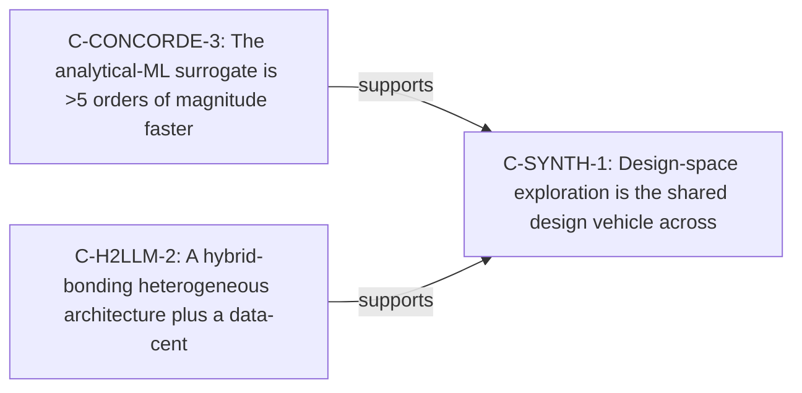

<!-- generated by render.py (brain-map) from graph.json@sha256:aae86bebeb9cd8b2 — regenerable; do not hand-edit -->

# Brain Map — claim-neighborhood of `C-SYNTH-1`

*A projection of the graph (edges). Only `confirmed` edges are shown (proposed/superseded excluded from the truth view).*

